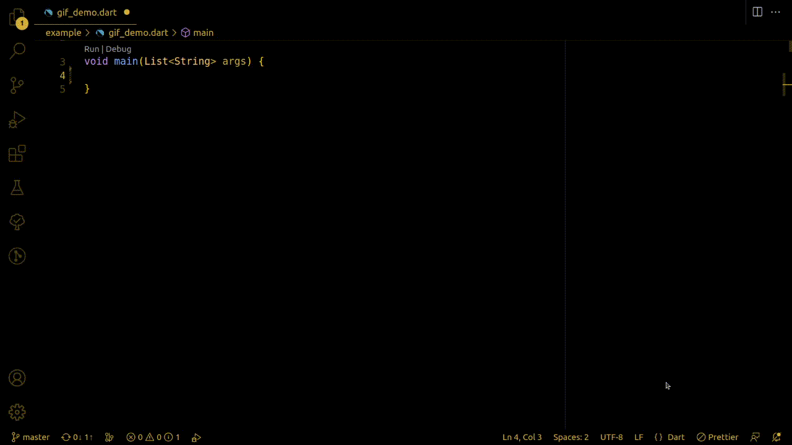

<!-- 
This README describes the package. If you publish this package to pub.dev,
this README's contents appear on the landing page for your package.

For information about how to write a good package README, see the guide for
[writing package pages](https://dart.dev/guides/libraries/writing-package-pages). 

For general information about developing packages, see the Dart guide for
[creating packages](https://dart.dev/guides/libraries/create-library-packages)
and the Flutter guide for
[developing packages and plugins](https://flutter.dev/developing-packages). 
-->

Library for parsing commandline arguments



## Features

Current release support arguments with next template:

- default arguments withoud value 
```bash
dart_app argument1 argument2
# ...return [argument1, argument2]
```
- named arguments splited with '=' or ' ' and started with '--'
```bash
dart_app --argument1 value1 --argument2=value2
# ...return { argument1: value1, argument2: value2 }
```

## Getting started

To start using the library you should only add library to your project

```bash
flutter pub add argenius
# or
dart pub add argenius
```

## Usage
Run next examples with next arguments:
```bash
dart bin/script.dart simpleArg --named1=value1 --named2 value2 simpleArtLast
```

### Global instace
Use global instalce of Argenius to working with your arguments in any place
of your code


```dart
import 'package:argenius/argenius.dart';

void main(List<String> args) {
  // Example 1.
  // Parse cmd arguments with using global argenus variable
  argenius.parse(args);

  // ...and you can start using argunius instance with your 
  // arguments on any place of your code

  print('Named arguments: ${argenius.named}');
  // { 'named1': 'value1', 'named2': 'value2' }

  print('Ordered arguments: ${argenius.ordered}');
  // [ 'simpleArg' 'simpleArtLast']
}
```

### Local instance
Use argenius like a local libarary to parse command line arguments

```dart
import 'package:argenius/argenius.dart';

// Run example with: dart script.dart 

void main(List<String> args) {
  // Example 2.
  // Create private instance of argenius and parse args on init
  Argenius privateArgenius = Argenius(args: args);

  // Example 3.
  // Parse arguments values some times later with parse method
  privateArgenius.parse(args);

  print('Named arguments: ${privateArgenius.named}');
  // { 'named1': 'value1', 'named2': 'value2' }

  print('Ordered arguments: ${privateArgenius.ordered}');
  // [ 'simpleArg' 'simpleArtLast']
}
```

## Additional information

 Copyright (c) 2023 Pavel Tretyakov
 
 Permission is hereby granted, free of charge, to any person obtaining
 a copy of this software and associated documentation files (the
 "Software"), to deal in the Software without restriction, including
 without limitation the rights to use, copy, modify, merge, publish,
 distribute, sublicense, and/or sell copies of the Software, and to
 permit persons to whom the Software is furnished to do so, subject to
 the following conditions:
 
 The above copyright notice and this permission notice shall be included
 in all copies or substantial portions of the Software.
 
 THE SOFTWARE IS PROVIDED "AS IS", WITHOUT WARRANTY OF ANY KIND,
 EXPRESS OR IMPLIED, INCLUDING BUT NOT LIMITED TO THE WARRANTIES OF
 MERCHANTABILITY, FITNESS FOR A PARTICULAR PURPOSE AND NONINFRINGEMENT.
 IN NO EVENT SHALL THE AUTHORS OR COPYRIGHT HOLDERS BE LIABLE FOR ANY
 CLAIM, DAMAGES OR OTHER LIABILITY, WHETHER IN AN ACTION OF CONTRACT,
 TORT OR OTHERWISE, ARISING FROM, OUT OF OR IN CONNECTION WITH THE
 SOFTWARE OR THE USE OR OTHER DEALINGS IN THE SOFTWARE.
